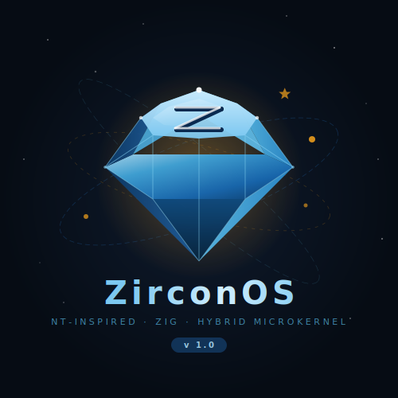
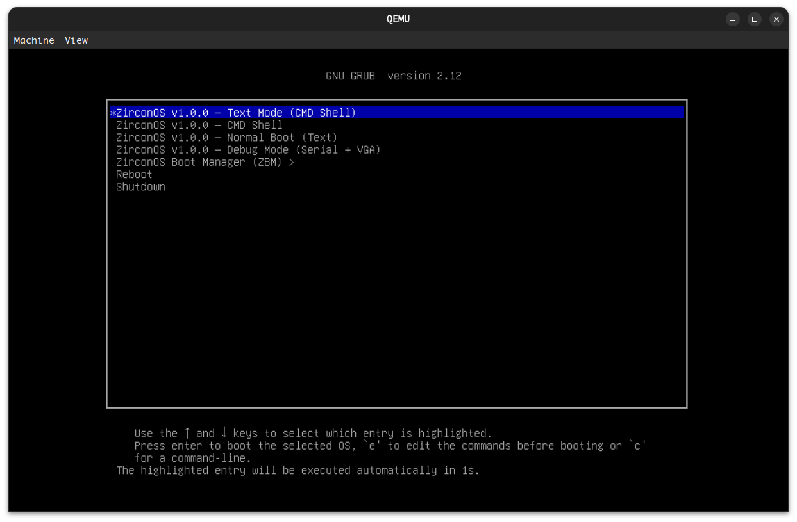
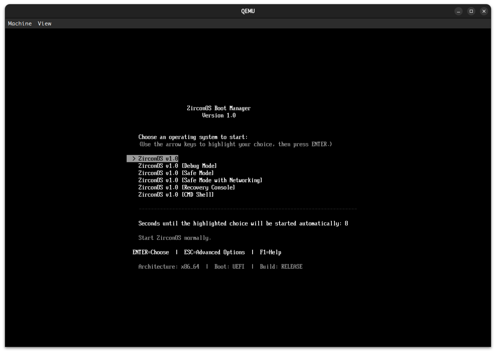
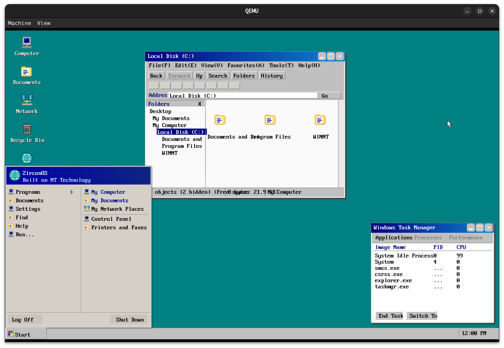
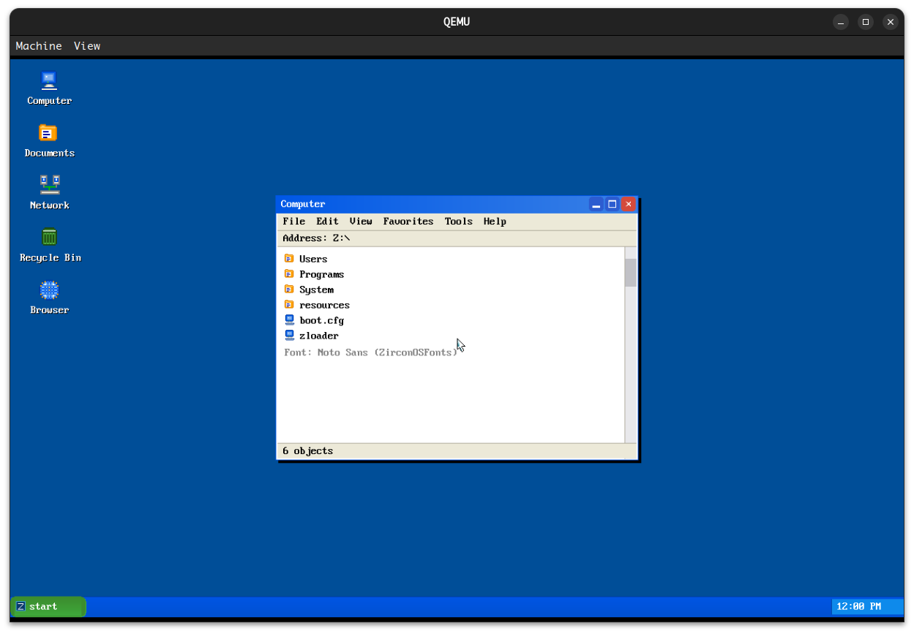
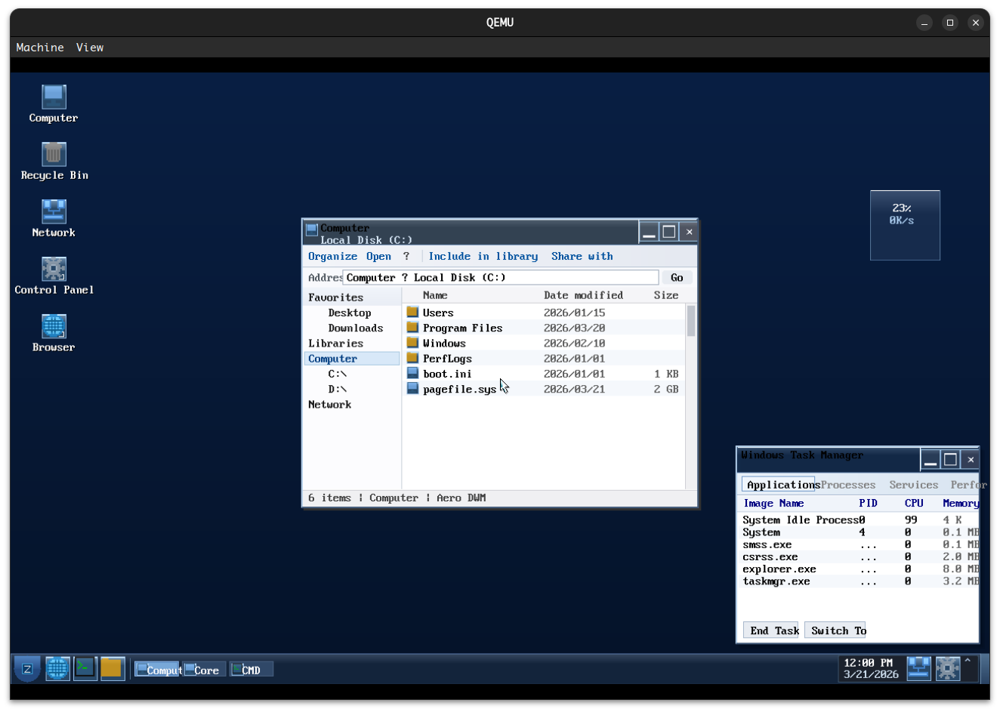
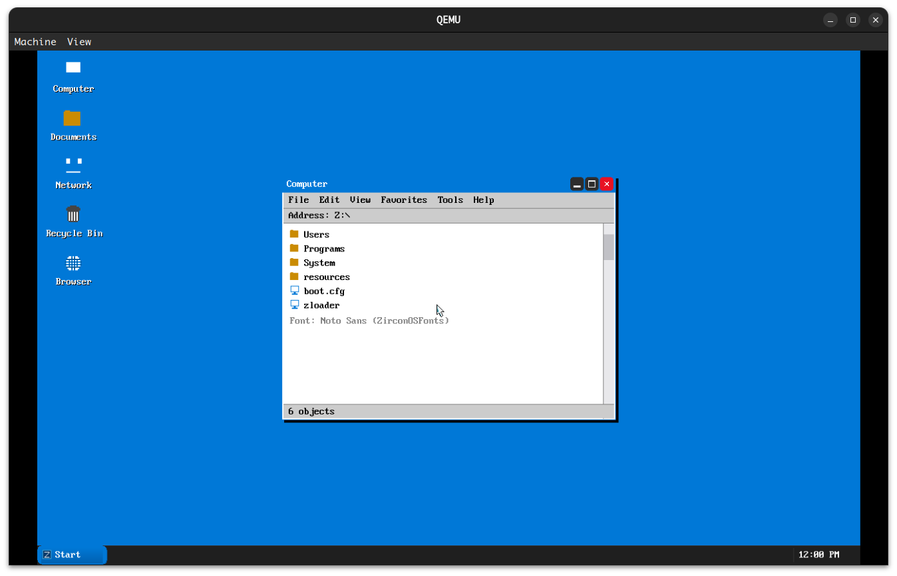
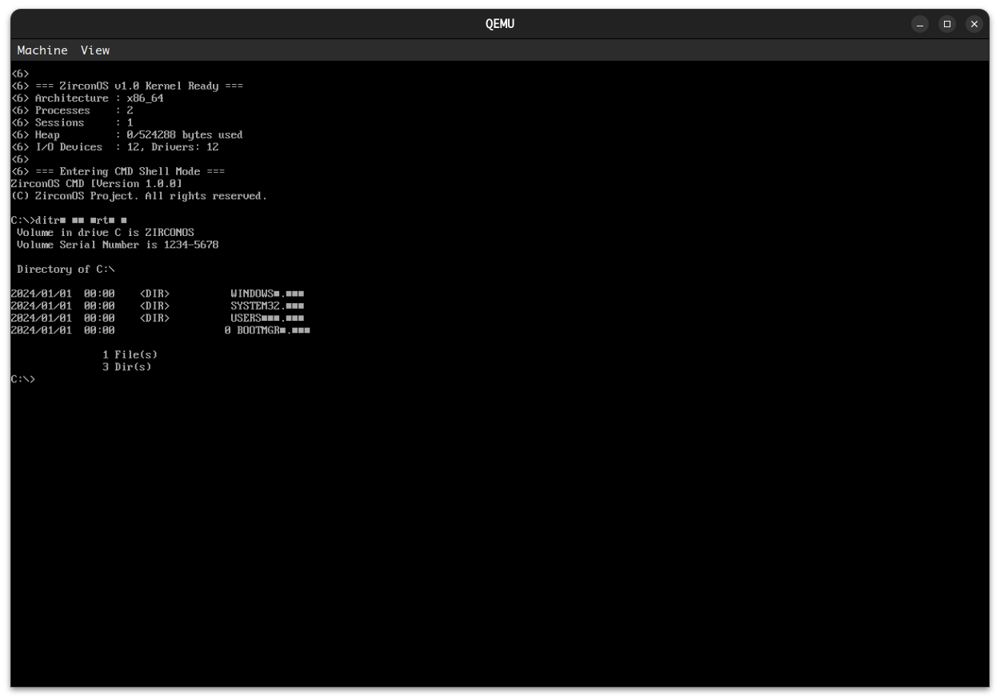

# ZirconOS v1.0

**ZirconOS** is an NT-style hybrid microkernel operating system implemented in Zig. It supports BIOS (GRUB Multiboot2) and UEFI boot.

<p align="center">
  
</p>

## Screenshots

<p align="center">
  
  &nbsp;
  
</p>
<p align="center"><em>GRUB menu · ZirconOS Boot Manager (ZBM)</em></p>

<p align="center">
  
  &nbsp;
  
</p>
<p align="center"><em>Classic (Windows 2000 style) · Luna (Windows XP style)</em></p>

<p align="center">
  
  &nbsp;
  
</p>
<p align="center"><em>Aero (Vista/7 style) · Modern (Windows 8 style)</em></p>

<p align="center">
  
</p>
<p align="center"><em>CMD shell</em></p>

**中文说明**：[README_cn.md](README_cn.md)

## Design

- **NT-style hybrid microkernel**: scheduling, virtual memory, IPC, interrupts, and syscalls in the kernel
- **User-mode system services**: Object Manager, Process Manager, I/O Manager, Security, etc.
- **Win32 compatibility layer**: ntdll, kernel32, kernelbase, and the console subsystem
- **Win32 subsystem server**: csrss-style management, window stations, and desktops
- **Win32 execution engine**: PE loading, DLL binding, process creation, API dispatch
- **Graphics subsystem**: user32 (windows/messages) and gdi32 (drawing/fonts/bitmaps)
- **WOW64**: PE32 loading, 32→64 syscall thunking, 32-bit PEB/TEB
- **Dual shell**: CMD and PowerShell-style shells
- **Dual filesystem**: FAT32 (system volume) and NTFS (data volume)
- **Multi-architecture**: x86_64 (primary), aarch64, loongarch64, riscv64, mips64el

Documentation: [`docs/README.md`](docs/README.md) · [`docs/en/Architecture.md`](docs/en/Architecture.md) · [`docs/en/Kernel.md`](docs/en/Kernel.md) · [`docs/en/Boot.md`](docs/en/Boot.md) · [`docs/en/Servers.md`](docs/en/Servers.md) · [`docs/en/Subsystems.md`](docs/en/Subsystems.md) · [`docs/en/BuildSystem.md`](docs/en/BuildSystem.md) · [`docs/en/Roadmap.md`](docs/en/Roadmap.md)

## Repository layout

```
ZirconOS/
├── build.zig              # Zig build
├── build.zig.zon          # Zig dependencies
├── run.sh                 # Build and run helper
├── Makefile               # Make entry point
├── assets/                # Logo and screenshots
├── scripts/               # Build helpers (see scripts/README.md)
├── gnu-efi/               # LoongArch GNU-EFI output (gitignored; make fetch-gnu-efi)
├── boot/
│   ├── grub/grub.cfg      # GRUB config (OS selection menu)
│   ├── uefi/main.zig      # UEFI boot app
│   └── zbm/               # ZirconOS Boot Manager (BIOS/MBR/GPT)
├── link/                  # Per-architecture linker scripts
│   └── x86_64.ld / aarch64.ld / loongarch64.ld / riscv64.ld / mips64el.ld
├── src/                   # Kernel sources
│   ├── main.zig           # Kernel entry (Phase 0–11 boot path)
│   ├── config/            # Config parser + embedded defaults (*.conf, defaults.zig)
│   ├── arch/              # Architecture code
│   │   ├── x86_64/        #   Multiboot2, paging, IDT, ISR, syscall
│   │   ├── aarch64/       #   AArch64 boot and paging
│   │   └── (loongarch64, riscv64, mips64el)
│   ├── hal/               # Hardware abstraction
│   │   ├── x86_64/        #   VGA, PIC, PIT, port I/O, serial, GDT, framebuffer
│   │   └── aarch64/       #   GIC, timer, PL011 UART
│   ├── drivers/           # Device drivers
│   │   └── video/         #   VGA, HDMI, framebuffer, display manager
│   ├── ke/                # Kernel Executive — scheduling, timer, interrupts, sync
│   ├── mm/                # Memory manager — physical frames, VM, heap
│   ├── ob/                # Object Manager — objects, handle table, namespace
│   ├── ps/                # Process subsystem — processes and threads
│   ├── se/                # Security — token, SID, access checks
│   ├── io/                # I/O Manager — devices, drivers, IRPs
│   ├── lpc/               # LPC — IPC ports and messages
│   ├── rtl/               # Runtime — kernel logging
│   ├── fs/                # File systems — VFS, FAT32, NTFS
│   ├── loader/            # Loader — PE32/PE32+/ELF
│   ├── libs/              # User-mode API libraries
│   │   ├── ntdll.zig      #   Native API (Nt*/Rtl*/Dbg*)
│   │   └── kernel32.zig   #   Win32 base API
│   ├── servers/           # System services
│   │   ├── server.zig     #   Process Server (PID 1)
│   │   └── smss.zig       #   Session Manager (SMSS)
│   └── subsystems/        # Subsystems
│       └── win32/         #   Win32 subsystem
│           ├── subsystem.zig  # csrss server
│           ├── exec.zig       # Win32 execution engine
│           ├── user32.zig     # Windowing API
│           ├── gdi32.zig      # GDI API
│           ├── console.zig    # Console runtime
│           ├── cmd.zig        # CMD
│           ├── powershell.zig # PowerShell-style shell
│           └── wow64.zig      # WOW64 layer
├── src/desktop/           # Desktop theme Zig projects; each has resources/
├── src/fonts/             # Shared open fonts (make fonts / scripts/fonts/fetch-fonts.sh)
└── docs/                  # Design docs (en/ and cn/)
```

## Desktop themes

Six Windows-inspired desktop themes, from Windows 2000 through Windows 11. Each theme is a Zig subproject under `src/desktop/<name>/` with static assets in `resources/`.

Fonts: run `make fonts` or `scripts/fonts/fetch-fonts.sh` to populate `src/fonts/`.

LoongArch UEFI links against GNU-EFI: `make fetch-gnu-efi` (outputs under `gnu-efi/`; see `scripts/README.md`).

| Theme | Windows era | Status | Notes |
|-------|----------------|--------|--------|
| Classic | Windows 2000 | Scaffold | 3D gray chrome, square windows |
| **Luna** | **Windows XP** | **Implemented** | Blue taskbar, green Start button, rounded frames |
| Aero | Vista / 7 | Scaffold | Glass, Flip 3D, Aero Snap |
| Modern | Windows 8 | Scaffold | Full-screen tiles, Metro flat UI, Charms |
| Fluent | Windows 10 | Scaffold | Acrylic, dark mode, Reveal |
| Sun Valley | Windows 11 | Scaffold | Mica, large corners, centered taskbar |

Select the theme in `src/config/desktop.conf` (embedded at build time):

```ini
[desktop]
theme = luna              # classic | luna | aero | modern | fluent | sunvalley
color_scheme = blue       # theme-specific scheme
```

## Dependencies

Ubuntu/Debian:

```bash
sudo apt update
sudo apt install -y grub-pc-bin grub-common xorriso mtools \
    qemu-system-x86 qemu-system-arm ovmf
```

Install Zig from [ziglang.org](https://ziglang.org/download/) and add it to `PATH`.

## Build and run

```bash
# run.sh (recommended)
./run.sh build              # Kernel (Debug)
./run.sh build-release      # Kernel (Release)
./run.sh iso                # Build ISO
./run.sh run                # Build ISO and run in QEMU (BIOS)
./run.sh run-debug          # BIOS + GDB server
./run.sh run-release        # BIOS Release
./run.sh run-uefi           # UEFI (x86_64)
./run.sh run-uefi-aarch64   # UEFI (aarch64)
./run.sh run-aarch64        # AArch64 bare metal
./run.sh clean              # Clean
./run.sh help               # Help

# Make shortcuts
make run
make run-debug
make clean
make help

# Zig directly
zig build -Darch=x86_64 -Ddebug=true -Denable_idt=true
```

## v1.0 feature matrix (Phase 0–11)

| Area | Status | Notes |
|------|--------|--------|
| GRUB boot | Done | Multiboot2, x86_64, multiple modes |
| UEFI boot | Done | UEFI app, Debug/Release, Phase 0–11 banner |
| VGA | Done | Text console |
| Serial | Done | COM1 |
| Frame allocator | Done | Bitmap allocator |
| Paging | Done | Four-level tables, identity map |
| Kernel heap | Done | Bump allocator |
| IPC (LPC) | Done | Queues, send/receive, ports |
| Syscall | Done | int 0x80 dispatch |
| IDT/ISR | Done | 256 vectors |
| Scheduler | Done | Round-robin |
| Timer | Done | PIC + PIT ~100Hz |
| Sync | Done | Event, mutex, semaphore, spinlock |
| Object Manager | Done | Types, handle table, namespace, waitable |
| Process Manager | Done | Processes/threads, Process Server |
| Session Manager | Done | SMSS, sessions, subsystem registration |
| Security | Done | Token, SID, access checks |
| I/O Manager | Done | Devices, drivers, IRP dispatch |
| VFS | Done | Mount points |
| FAT32 | Done | Files/dirs on `C:\` |
| NTFS | Done | MFT, files/dirs on `D:\` |
| PE32+ loader | Done | Headers, DLLs, imports, relocs, PEB/TEB |
| PE32 loader | Done | 32-bit PE, WOW64 |
| ELF loader | Done | ELF64 headers, segments, shared objects |
| ntdll | Done | Native API surface |
| kernel32 | Done | Win32 base API |
| user32 | Done | Windows, messages, classes, UI primitives, input |
| gdi32 | Done | DC, primitives, fonts, bitmaps, BitBlt |
| Console | Done | Console runtime |
| CMD | Done | dir, cd, set, ver, systeminfo, tasklist, … |
| PowerShell | Done | cmdlet-style commands |
| csrss | Done | Win32 server, stations, desktops, GUI dispatch |
| Exec engine | Done | PE load, DLL bind, lifecycle |
| WOW64 | Done | PE32, syscall thunking, 32-bit PEB/TEB |

## Milestones

- **Phase 0** — Toolchain and QEMU debugging  
- **Phase 1** — Boot and early kernel (GDT/Multiboot2/frame/heap)  
- **Phase 2** — Traps, timer, scheduler  
- **Phase 3** — VM and user mode  
- **Phase 4** — Objects, handles, process core  
- **Phase 5** — IPC and system services (SMSS/LPC)  
- **Phase 6** — I/O, filesystems (FAT32/NTFS), drivers  
- **Phase 7** — Loaders (PE32/PE32+/ELF, DLLs, imports, relocs)  
- **Phase 8** — Native userland (ntdll/kernel32, CMD, PowerShell)  
- **Phase 9** — Win32 subsystem (csrss, exec engine, PE/DLL)  
- **Phase 10** — Graphics (user32, gdi32, message queue, GUI dispatch)  
- **Phase 11** — WOW64 (PE32, thunking, 32-bit PEB/TEB)  
